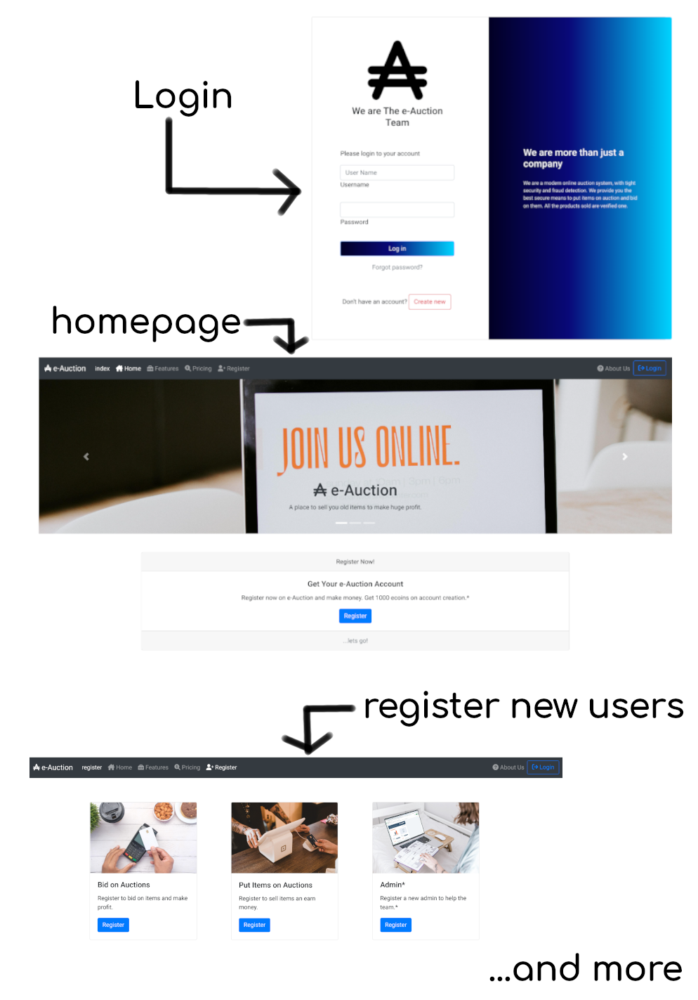

# e-Auction System

## Report

- [link](assets/Online_Auction.docx)

## Technologies Used

- [bootstrap v4.6](https://getbootstrap.com/docs/4.6/getting-started/build-tools/)
- [django v.4.0](https://docs.djangoproject.com/en/4.0/)
- [font awesome icons v6.1](https://fontawesome.com/search?s=solid%2Cbrands)
- [style guide for python](https://peps.python.org/pep-0008/)

## Setup

- Create python virtual environment - `python3 -m venv django`
- Activate the virtual environment - `source ./django/bin/activate` for linux
- Install the required modules in the `pip3 install -r requirements.txt`

## Run

- `python manage.py runserver` - for running server
- `python manage.py makemigrations auction` - making migrations
- `python manage.py migrate` applying migrations to database
- `python manage.py createsuperuser` - create admin user

## Resources Used

- [django docs](https://docs.djangoproject.com/)
- [stackoverflow](https://stackoverflow.com)
- [mozilla mdn docs](https://developer.mozilla.org)

## License

MIT
